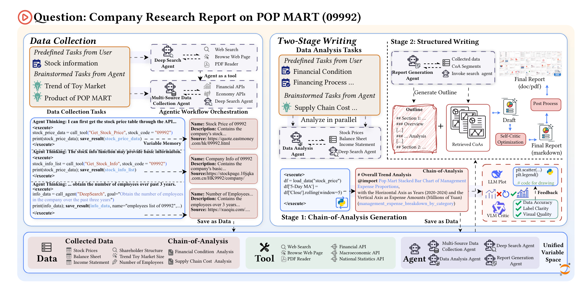

<div align="center">


QuantHarbor
---

*AI-Powered Financial Research Platform — From data to insights, fully automated.*

<p>

[](LICENSE)
[](https://www.python.org/)


</p>

**QuantHarbor** is an end-to-end financial intelligence platform that transforms unstructured market documents into citation-grounded insights through automated retrieval, analysis, and report generation. It combines a multi-agent research system with a document-to-insight RAG pipeline, all wrapped in an interactive web demo UI.

</div>

## Table of Contents
- [Key Features](#key-features)
- [Quick Start](#quick-start)
- [Architecture](#architecture)
- [Project Achievements](#project-achievements)
- [Advanced Usage](#advanced-usage)
- [License](#license)
- [Acknowledgments](#acknowledgments)

## Key Features

* **Document-to-Insight RAG Pipeline**
    Ingests large PDF corpora, builds searchable vector indexes, and produces citation-grounded research output with file/page provenance and similarity scores.

* **Multi-Agent Financial Research**
    Four specialized agents (Data Collector, Data Analyzer, Report Generator, Deep Search) collaborate through a shared variable space using the Code Agent with Variable Memory (CAVM) architecture.

* **Professional Report Generation**
    One-click generation of 20,000+ word financial reports with automated charting. Reports are exported as Markdown, DOCX, and PDF with publication-grade formatting via Pandoc.

* **Automated Charting with VLM Feedback**
    Built-in vision agents automatically correct chart issues (missing legends, wrong scales, low information density) through iterative visual feedback loops.

* **Deep Research with Evidence Tracing**
    Every conclusion is derived from a transparent Chain-of-Analysis, with strict citations linking back to original data sources for verifiable insights.

* **Provider Flexibility**
    Supports OpenAI and DeepSeek with configurable primary/fallback routing. Compatible with aggregator endpoints like OpenRouter.

* **Interactive Web Demo UI**
    Full-stack web application with React frontend (Ant Design) and FastAPI backend. Includes system configuration, task management, real-time execution monitoring via WebSocket, and report browsing/download.

* **Checkpoint & Resume**
    Long-running research tasks can be paused and resumed from the last checkpoint, with full agent state preservation.

* **Reproducible Local Artifacts**
    Saves parsed corpus and index artifacts for deterministic reruns and debugging.

---

## Quick Start

### Prerequisites

- Python 3.10+
- Pandoc (for polished DOCX/PDF export)
- Node.js (optional, for the web UI)
- API keys for your LLM stack (LLM, VLM, Embedding, Search)

### Installation

```bash
# Clone the repository
git clone https://github.com/YOUR_USERNAME/quant_integrated_project.git
cd quant_integrated_project

# Create virtual environment
python3 -m venv .venv
source .venv/bin/activate
pip install -U pip

# Install Python dependencies
pip install -r requirements.txt
```

Install Pandoc (recommended):

```bash
# macOS
brew install pandoc

# Linux
sudo apt-get install pandoc
```

Build the web UI (optional):

```bash
cd demo/frontend
npm install
npm run build
```

### Configuration

QuantHarbor uses a two-layer configuration:

1) `.env` — model endpoints & API keys
```bash
cp .env.example .env
# Fill in your API keys and model endpoints
```

2) `my_config.yaml` — research target & tasks
```yaml
target_name: "Apple Inc."
stock_code: "AAPL"
target_type: "financial_company"  # financial_company | macro | industry | general
output_dir: "./outputs/my-research"
language: "en"                    # en or zh
```

### Run QuantHarbor

**CLI (full pipeline)**
```bash
python run_report.py
```

**Web Demo**
```bash
# Backend
cd demo/backend && python app.py

# Frontend (in a separate terminal)
cd demo/frontend && npm run dev
```
Open http://localhost:3000

**RAG Pipeline (document-to-insight)**
```bash
# 1) Provider smoke test
python3 scripts/smoke_test_providers.py --provider auto

# 2) Ingest PDF corpus
python3 scripts/ingest_pdfs.py --source-dir "./data/raw_pdfs" --recursive true

# 3) Build retrieval index
python3 scripts/build_index.py

# 4) Generate report output
python3 scripts/run_pipeline.py --question "Summarize investment risks and opportunities."
```

---

## Architecture

<p align="center">
  
</p>

QuantHarbor combines two complementary pipelines:

### Multi-Agent Research Pipeline (Web Demo)

A multi-stage, memory-centric pipeline: Data Collection, Analysis + VLM chart refinement, Report drafting & polishing, Rendering. Each agent runs in a shared variable space with resumable checkpoints.

| Agent | Purpose | Key Inputs | Outputs |
|-------|---------|------------|---------|
| Data Collector | Route and gather structured/unstructured data | Task, ticker/market | Normalized datasets in memory |
| Deep Search Agent | Multi-hop web search + content fetch with source validation | Task, query | Search snippets + crawled pages with citations |
| Data Analyzer | Code-first analysis, charting, VLM critique | Task, collected data | Analysis report, charts + captions |
| Report Generator | Outline, sections, polish, cover/reference, DOCX/PDF | Task, analysis/memory | Publication-ready report (MD/DOCX/PDF) |

### RAG Pipeline (CLI)

A modular document-to-insight pipeline:

1. **Ingestion** — Parse PDF pages and detect low-extraction pages for OCR follow-up
2. **Indexing** — Chunk text and build embedding index
3. **Retrieval** — Retrieve top-k relevant chunks per query via cosine similarity
4. **Reasoning** — Analyze evidence with LLMs under provider routing
5. **Report Generation** — Return concise, citation-grounded research output

### Code Structure

```
quant_integrated_project/
├── src/                    # Multi-agent system (CAVM architecture)
│   ├── agents/             # Data Collector, Analyzer, Report Generator, Search Agent
│   ├── config/             # Configuration management
│   ├── template/           # Report outline templates
│   ├── tools/              # Financial, macro, industry, web tools
│   └── utils/              # LLM interface, logging, prompt loader
├── src_rag/                # RAG pipeline modules
│   ├── agents/             # Planner, Retriever, Analyst, Writer agents
│   ├── core/               # LLM client, embeddings, vector index, pipeline
│   └── tools/              # PDF ingest, web search
├── demo/                   # Full-stack web demo
│   ├── backend/            # FastAPI app with WebSocket logs
│   └── frontend/           # React SPA (Ant Design)
├── scripts/                # CLI pipeline scripts
├── assets/                 # Images, videos, example reports
├── data/                   # PDF corpus and parsed pages
├── artifacts/              # Vector index (embeddings + metadata)
├── config/                 # RAG pipeline configuration
└── docs/                   # Advanced usage documentation
```

---

## Project Achievements

### Measured in Current Local Run

- Processed **138 PDFs** end-to-end in one corpus ingestion run.
- Extracted **4,577 pages** into normalized machine-readable records.
- Built a searchable vector index with **8,309 chunks**.
- Generated structured, citation-grounded outputs with file/page provenance.

### Representative Internal Benchmark

- Reduced initial research synthesis time from manual multi-document review to **minutes-level automated generation** for first-draft outputs.
- Enabled deterministic reruns via persisted parsed/index artifacts, improving reproducibility for iterative analysis.
- Introduced provider failover routing (OpenAI + DeepSeek) to improve runtime robustness under API availability constraints.

---

## Advanced Usage

See **[docs/ADVANCED_USAGE.md](docs/ADVANCED_USAGE.md)** for comprehensive technical documentation including:

- API keys & model configuration
- YAML config file reference
- Prompt system & customization
- Custom outlines & report templates
- Chart styling & color palettes
- Adding custom tools and agents
- Checkpoint & resume system
- Complete code examples

---

## Output Artifacts

- Parsed pages: `data/parsed/pages.json`
- Index metadata: `artifacts/rag_index/metadata.json`
- Index embeddings: `artifacts/rag_index/embeddings.npy`
- Generated reports: `outputs/<target_name>/` (MD, DOCX, PDF)
- Agent logs: `outputs/<target_name>/logs/`

---

## License

This project is licensed under the GNU General Public License v3.0. See the [LICENSE](LICENSE) file for details.

---

## Documentation

- Advanced usage: [docs/ADVANCED_USAGE.md](docs/ADVANCED_USAGE.md)
- API setup: [docs/api_setup_openai_deepseek.md](docs/api_setup_openai_deepseek.md)
- OCR and extraction notes: [docs/pdf_coverage_and_ocr.md](docs/pdf_coverage_and_ocr.md)
- Migration notes: [docs/migration_notes.md](docs/migration_notes.md)

---

## Acknowledgments

- [AkShare](https://akshare.akfamily.xyz/) — Financial data APIs.
- [eFinance](https://github.com/mpquant/efinance) — Stock data.
- [Crawl4AI](https://github.com/unclecode/crawl4ai) — Web crawling.
- [Ant Design](https://ant.design/) — React UI component library.
